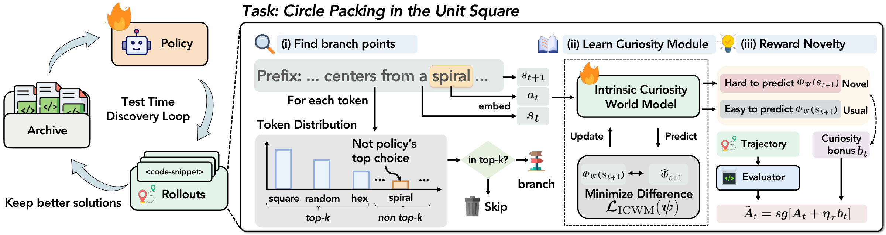
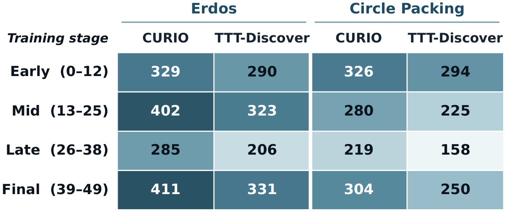
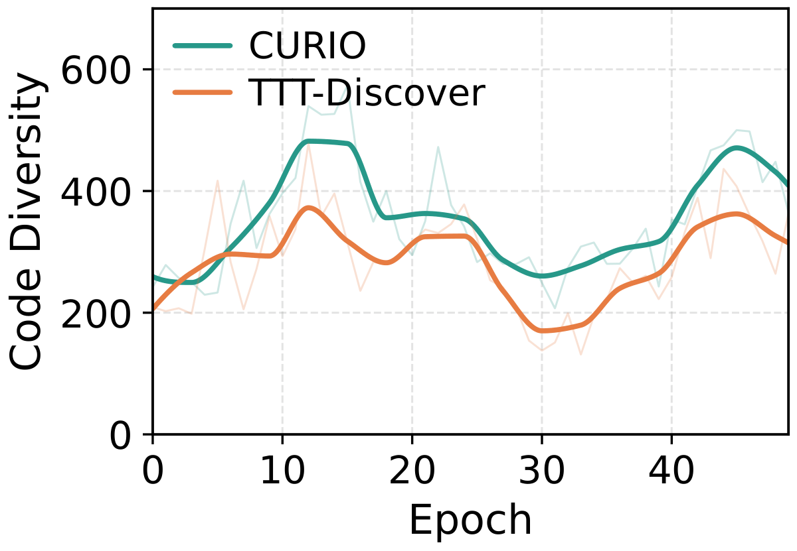
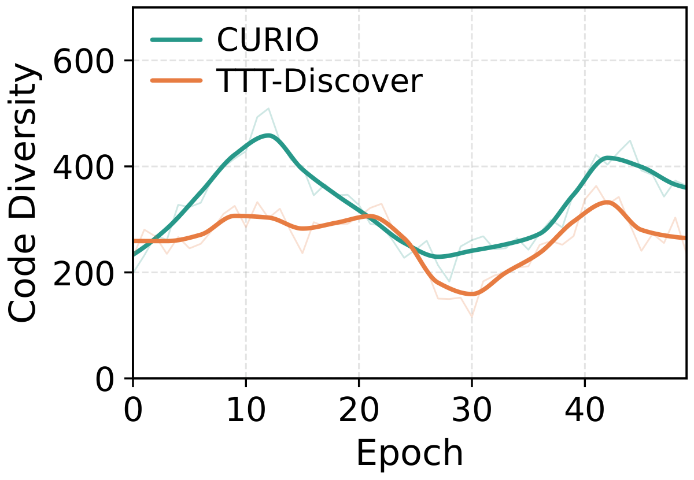
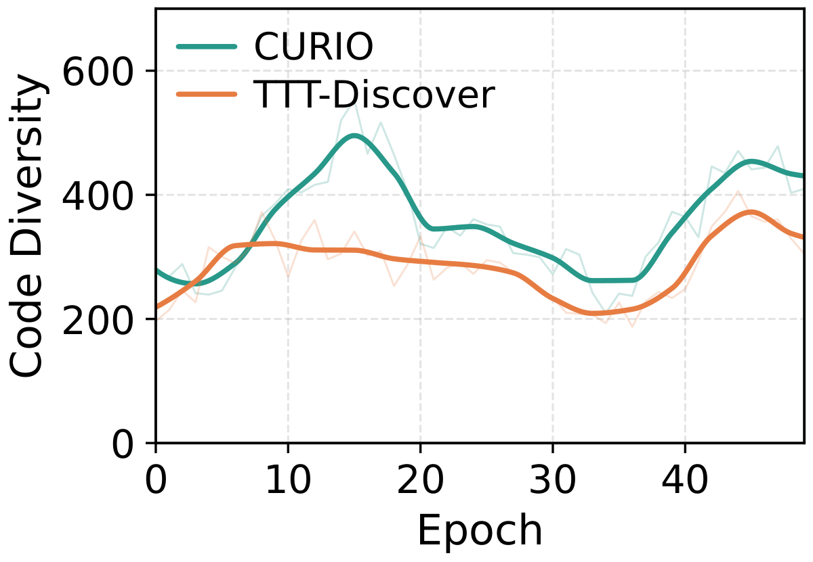
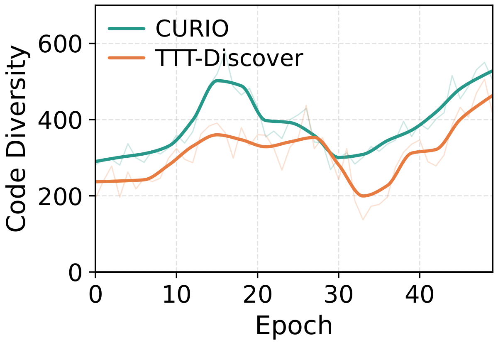
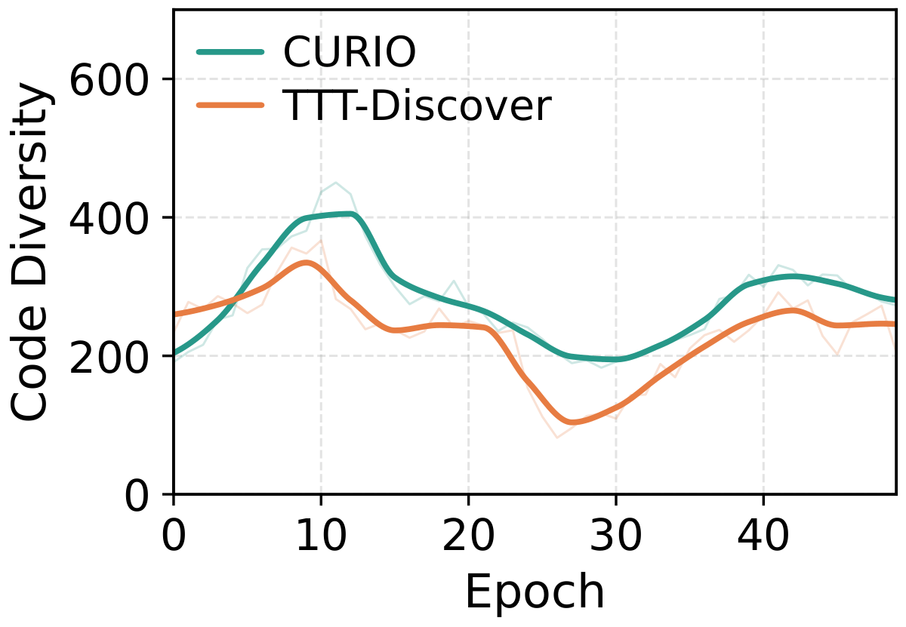
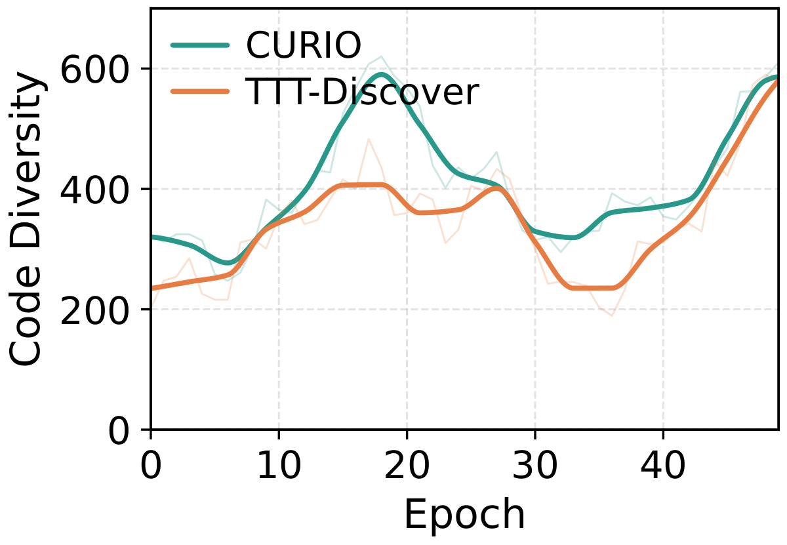

<h1 align="center">CURIO: Curiosity-Driven Test-Time Learning for Open-Ended Discovery</h1>


<div align="center">
  <p>
    <a href="#"></a>
    <a href="#"></a>
    <br>
    <a href="https://github.com/ft2023/CURIO/stargazers"></a>
    <a href="https://github.com/ft2023/CURIO/forks"></a>
    <a href="https://github.com/ft2023/CURIO/issues"></a>
    <a href="https://www.python.org/downloads/release/python-3124/"></a>
  </p>
</div>


## 🧩 Overview

**CURIO** is a curiosity-driven test-time learning framework for **open-ended discovery**. An LLM policy proposes programs for a hard problem, an evaluator scores them, and the policy is updated with reinforcement learning *on that same problem* while discovery is running.

Learning only from task reward tends to collapse the policy onto whatever currently scores best, which can suppress low-reward directions that would have paid off later. CURIO adds a learned exploration signal: an **Intrinsic Curiosity World Model (ICWM)** learns token-level transitions in the policy's own hidden-state space, and its prediction error becomes a curiosity bonus at the tokens where the policy departs from its top choice.

**Highlights**

- **Curiosity in the policy's own representation space**: The ICWM (encoder + forward predictor) models transitions between last-layer hidden states of the *current* actor, so "surprise" is measured relative to what the policy itself has learned so far.

- **Selective, token-local bonus**: Prediction residuals are normalized per epoch and applied only at sampled tokens outside the policy's top-$k$ choices (the "branch points"), leaving all other tokens to task feedback alone.

- **Annealed, drop-in combination with task RL**: The bonus is added to the TTT-Discover-style task coefficient under a cosine-annealed weight $\eta_\tau$. Setting $\eta_0 = 0$ recovers the task-only control exactly.

- **Fully local training stack**: Generation runs on [Ray Data LLM](https://docs.ray.io/en/latest/data/working-with-llms.html) (vLLM) and LoRA training on [DeepSpeed](https://github.com/deepspeedai/deepspeed) (ZeRO-2 + Ulysses sequence parallelism) — no hosted training API required.

- **Resumable, cluster-friendly runs**: Every epoch checkpoints each stage (sample → generate → evaluate → archive → train), with launchers for a single node and for SLURM clusters.


<div align="center">
  
</div>

<p align="center"><em>CURIO augments the test-time discovery loop with (i) non-top-k branch-point selection, (ii) an Intrinsic Curiosity World Model over policy hidden states, and (iii) a prediction-error curiosity bonus combined with the task coefficient.</em></p>


## 📰 News

- 🚀 **[2026-10]**: We release the code of **CURIO**!


## 📊 Results

We evaluate CURIO on six mathematical discovery tasks and single-cell denoising, with Qwen3 backbones from 8B to 235B. All numbers are means over three runs. The matched task-only control is **TTT-Discover** (CURIO with $\eta_0 = 0$).

**Mathematical discovery** (best feasible objective per run; ↓ lower / ↑ higher is better)

| Scale | Method | Erdős ↓ | AC1 ↓ | AC2 ↑ | AC3 ↓ | Circle Packing ↑ | Hadamard ↑ |
|:--|:--|:--:|:--:|:--:|:--:|:--:|:--:|
| 8B | TTT-Discover | 0.380995 | 1.50546 | 0.9463 | 1.4935 | **2.63598** | 0.5809 |
| 8B | **CURIO** | **0.380932** | **1.50513** | **0.9481** | **1.4846** | **2.63598** | **0.6048** |
| 14B | TTT-Discover | 0.380979 | 1.50608 | 0.9391 | 1.4592 | **2.63598** | 0.5864 |
| 14B | **CURIO** | **0.380919** | **1.50591** | **0.9418** | **1.4578** | **2.63598** | **0.6061** |
| 235B | TTT-Discover | 0.380918 | 1.50376 | 0.9562 | 1.4561 | **2.63598** | 0.7846 |
| 235B | **CURIO** | **0.380880** | **1.50315** | **0.9588** | **1.4549** | **2.63598** | **0.9284** |

**Single-cell denoising** (PBMC / Tabula held-out corpora)

| Scale | Method | PBMC Score ↑ | PBMC MSE ↓ | PBMC Poisson ↓ | Tabula Score ↑ | Tabula MSE ↓ | Tabula Poisson ↓ |
|:--|:--|:--:|:--:|:--:|:--:|:--:|:--:|
| 8B | TTT-Discover | 0.6842 | 0.2087 | 0.0818 | 0.6468 | 0.1963 | 0.0363 |
| 8B | **CURIO** | **0.7009** | **0.1552** | **0.0493** | **0.7165** | **0.1485** | **0.0301** |
| 14B | TTT-Discover | 0.6901 | 0.1615 | 0.0492 | 0.7012 | 0.1526 | 0.0301 |
| 14B | **CURIO** | **0.7052** | **0.1555** | **0.0491** | **0.7218** | **0.1423** | **0.0292** |
| 235B | TTT-Discover | 0.7011 | 0.1562 | 0.0491 | 0.7254 | 0.1401 | 0.0291 |
| 235B | **CURIO** | **0.7156** | **0.1501** | **0.0490** | **0.7408** | **0.1334** | **0.0281** |

Comparisons with AlphaEvolve, ShinkaEvolve, ThetaEvolve, SimpleTES and Best-of-25600 are in the paper.

**Code-level solution diversity.** CURIO keeps higher code diversity than task-only RL across training (OpenEvolve island code-diversity metric):

<div align="center">
  
</div>

<details>
<summary>Per-task diversity curves</summary>

| Erdős | AC1 | AC2 |
|:--:|:--:|:--:|
|  |  |  |
| **AC3** | **Circle Packing** | **Hadamard** |
|  |  |  |

</details>


## 🧪 Tasks

| Task | Description | Objective | Default $\eta_0$ |
|:--|:--|:--:|:--:|
| `erdos` | Erdős minimum-overlap problem (C5 bound) | Minimize | 0.5 |
| `ac1` | First autocorrelation inequality | Minimize | 0.3 |
| `ac2` | Second autocorrelation inequality | Maximize | 0.3 |
| `ac3` | Third autocorrelation inequality | Minimize | 0.3 |
| `circle_packing` | Packing $n=26$ circles in the unit square (sum of radii) | Maximize | 0.3 |
| `hadamard` | $\pm 1$ matrix maximizing $|\det|$ (determinant ratio; following ThetaEvolve) | Maximize | 0.5 |
| `denoising` | Single-cell RNA-seq denoising (Score / MSE / Poisson NLL) | Maximize Score | 0.5 |

Each task lives in `tasks/<task>/` with its own `env.py`, `prompt.py`, `evaluator.py`, evaluator `requirements.txt`, and `launchers/`. See [`tasks/README.md`](tasks/README.md) to add a new task.


## 📁 Repository Layout

```
CURIO/
├── main.py                 # Epoch loop: sample → generate → evaluate → archive → train
├── config.py               # Run configuration (all CURIO_* environment variables)
├── core/
│   ├── icm.py              # Intrinsic Curiosity World Model (encoder + forward predictor)
│   ├── trainer.py          # DeepSpeed LoRA trainer, KL correction, curiosity bonus
│   ├── generator.py        # Ray Data LLM / vLLM generation, non-top-k mask extraction
│   ├── evaluator.py        # Sharded candidate evaluation
│   ├── archive.py          # Solution archive
│   ├── sampler.py          # PUCT parent sampling
│   └── renderer.py         # Qwen chat rendering
├── tasks/<task>/           # Task definitions, evaluators, and launchers
├── patches/                # Required Ray Data LLM LoRA fix
└── tests/                  # Unit and parity tests
```


## ⚙️ Setup

### Requirements

- Python 3.12 for the runtime (tested with 3.12.4; we recommend [`uv`](https://github.com/astral-sh/uv)).
- One or more GPUs on which the policy model fits on a single card (tensor parallel size > 1 is not yet supported).
- A separate evaluator Python environment per task.

### Environment split

CURIO uses two separate Python environments on purpose:

- **Runtime env** (`requirements.txt`): generation and training.
- **Evaluator env** (`tasks/<task>/requirements.txt`): scoring candidate programs, isolated so runtime upgrades never change evaluator results.

```bash
git clone https://github.com/ft2023/CURIO.git
cd CURIO

# Runtime env
uv venv .venvs/curio-runtime --python 3.12
uv pip install -r requirements.txt --python .venvs/curio-runtime

# Evaluator env for one task (example: erdos)
uv venv .venvs/curio-eval-erdos --python 3.12
uv pip install -r tasks/erdos/requirements.txt --python .venvs/curio-eval-erdos
```

> [!NOTE]
> The `denoising` evaluator needs Python 3.11 (see `tasks/denoising/requirements.txt`). Its data are fetched through `openproblems` on first use.

### Required patch: Ray Data LLM LoRA fix

> [!IMPORTANT]
> `ray[llm]==2.54.0` has a bug where LoRA adapters have no effect during generation, so the policy never benefits from training. Apply the patch inside the runtime env:

```bash
source .venvs/curio-runtime/bin/activate
cp patches/vllm_engine_stage.py \
  "$(python -c 'import ray, os; print(os.path.dirname(ray.__file__))')/llm/_internal/batch/stages/vllm_engine_stage.py"
```

See [`patches/README.md`](patches/README.md) for details.


## 🚀 Quick Start

Each task ships launchers in `tasks/<task>/launchers/`:

- `single_node/`: everything on one machine (`run_all.sh`, `run_one_epoch.sh`, `run_smoke.sh`).
- `slurm_attached/`: interactive access to a GPU node plus a CPU array partition for parallel evaluation.
- `slurm_alloc/`: SLURM without interactive GPU access.

Hardware presets live in `tasks/<task>/launchers/configs/` — pick the one matching your GPUs (e.g. `qwen3_8b_2xH100`) or copy one and edit it.

**Smoke test** (1 epoch, tiny config) on Erdős:

```bash
source .venvs/curio-runtime/bin/activate

export CURIO_ERDOS_CONFIG=qwen3_8b_2xH100                         # preset name, without .sh
export CURIO_EVAL_PYTHON=$PWD/.venvs/curio-eval-erdos/bin/python
export CURIO_LOG_ROOT=/path/to/your/log/root

bash tasks/erdos/launchers/single_node/run_smoke.sh
```

**Full run** (50 epochs), and resuming after interruption:

```bash
bash tasks/erdos/launchers/single_node/run_all.sh

# Resume: point CURIO_RESUME_DIR at the existing run directory and call again
export CURIO_RESUME_DIR=/path/to/your/log/root/<run_dir>
bash tasks/erdos/launchers/single_node/run_all.sh
```

Other tasks follow the same pattern with `CURIO_<TASK>_CONFIG` (e.g. `CURIO_HADAMARD_CONFIG`, `CURIO_DENOISING_CONFIG`).

**Task-only baseline (TTT-Discover).** Add `export CURIO_ICM_ETA=0` to your config preset to disable the curiosity bonus.

> [!TIP]
> Ray uses UNIX-domain sockets under its temp root, so keep that path short. CURIO picks, in order: `CURIO_RAY_TMPDIR`, `SLURM_TMPDIR`, `TMPDIR`, then `/tmp/$USER`.


## 🛠️ Commonly Used Configs

All options are environment variables read in [`config.py`](config.py); presets set them for you.

**Curiosity (ICWM)**
- `CURIO_ICM_ETA`: initial curiosity weight $\eta_0$ (`0` disables curiosity). Annealed by cosine to a floor of $0.1\,\eta_0$ over training.
- `CURIO_ICM_LEARNING_RATE`: ICWM AdamW learning rate (default `5e-6`).
- `CURIO_ICM_INTERMEDIATE_DIM`: forward-predictor width (`0` = backbone hidden size).
- `CURIO_CDRLHF_TOPK`: $k$ for the non-top-$k$ branch-point mask (default `1`).

**Discovery loop**
- `CURIO_NUM_EPOCHS`: number of epochs $E$ (paper: 50).
- `CURIO_SEEDS_PER_EPOCH`: parent groups per epoch $N$ (paper: 8).
- `CURIO_ROLLOUTS_PER_SEED`: rollouts per parent $G$ (paper: 64).
- `CURIO_PUCT_C`: PUCT exploration constant for parent selection.
- `CURIO_MAX_ARCHIVE_SIZE`, `CURIO_TOPK_CHILDREN`: archive capacity and retained children per parent.
- `CURIO_TEMPERATURE`, `CURIO_CONTEXT_WINDOW`: sampling temperature and context length.

**Policy optimization**
- `CURIO_MODEL_NAME_OR_PATH`: backbone (e.g. `Qwen/Qwen3-8B`).
- `CURIO_LEARNING_RATE`, `CURIO_LORA_RANK`, `CURIO_LORA_ALPHA`, `CURIO_LORA_TARGET_MODULES`: LoRA training.
- `CURIO_KL_PENALTY_COEF`: reference-correction coefficient $\lambda$ (paper: 0.1).
- `CURIO_REMOVE_CONSTANT_REWARD_GROUPS`: drop groups whose rollouts all share one reward.

**Parallelism & memory**
- `CURIO_GENERATOR_DATA_PARALLEL_SIZE`: number of vLLM replicas.
- `CURIO_TRAINER_NUM_WORKERS`, `CURIO_SEQUENCE_PARALLEL_SIZE`: training ranks and Ulysses sequence-parallel size.
- `CURIO_TRAINER_MAX_TOKENS_PER_RANK`: per-rank token budget for sequence packing.
- `CURIO_EVALUATOR_NUM_WORKERS`: parallel evaluation workers.

**Run control**
- `CURIO_LOG_ROOT` / `CURIO_RESUME_DIR`: output root, or an existing run to resume.
- `CURIO_STAGE_START` / `CURIO_STAGE_STOP`: run only a range of stages (`sample`, `generate`, `evaluate`, `archive_update`, `train`).

For the differences between this training stack and the original TTT-Discover implementation, see [`KNOWN_DIFFERENCES.md`](KNOWN_DIFFERENCES.md).


## 🙏 Acknowledgments

CURIO's discovery loop and training stack build on **[nanodiscover](https://github.com/cheongalc/nanodiscover)**, a Tinker-free reimplementation of **[TTT-Discover](https://github.com/test-time-training/discover)** ([paper](https://arxiv.org/abs/2601.16175)). The ICWM architecture and loss follow the Intrinsic Curiosity Module of **[CD-RLHF](https://github.com/ernie-research/CD-RLHF)**, which builds on [Pathak et al. (2017)](https://arxiv.org/abs/1705.05363). Task definitions follow TTT-Discover, [AlphaEvolve](https://deepmind.google/discover/blog/alphaevolve-a-gemini-powered-coding-agent-for-designing-advanced-algorithms/) and [ThetaEvolve](https://github.com/ypwang61/ThetaEvolve), and the denoising benchmark uses [Open Problems in Single-Cell Analysis](https://openproblems.bio/). We thank all of these authors for releasing their code and benchmarks.


## 📚 Citation

```bibtex
@article{feng2026curio,
  title={CURIO: Curiosity-Driven Test-Time Learning for Open-Ended Discovery},
  author={Feng, Tao and Yu, Fangxu and Lei, Zijie and Zou, Jiaru and Jiang, Changjiang and Yan, Yi and You, Jiaxuan and Lu, Pan},
  journal={arXiv preprint},
  year={2026}
}
```
